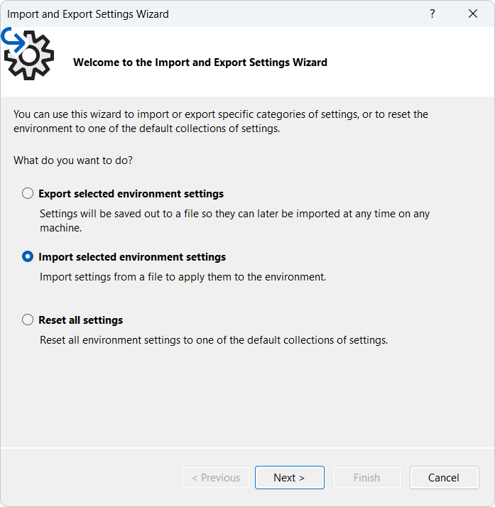
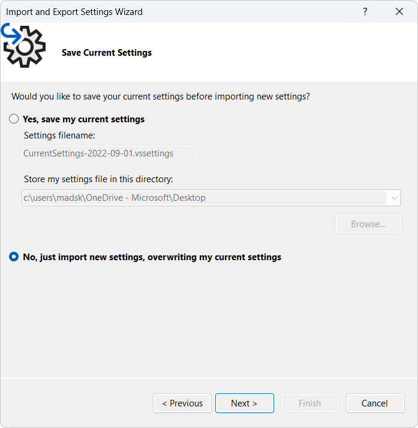
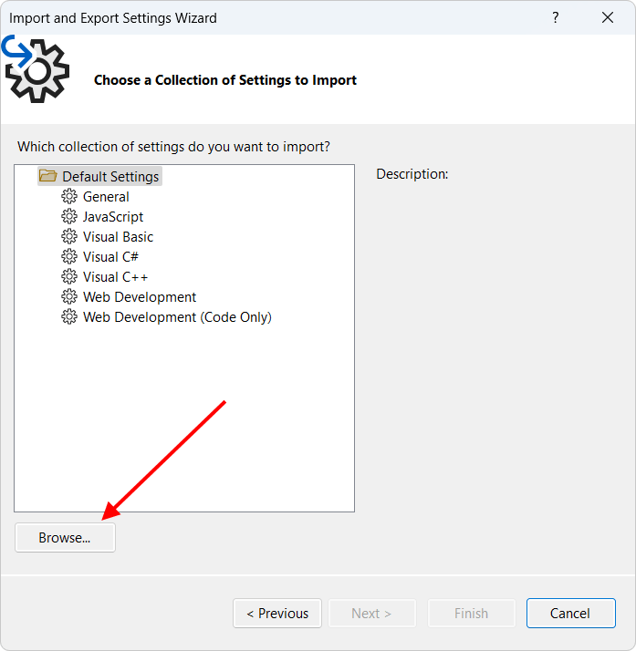
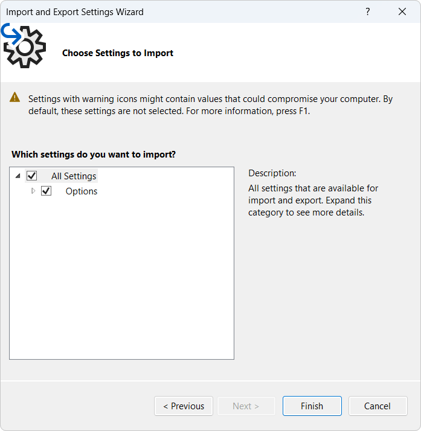

[marketplace]: https://marketplace.visualstudio.com/items?itemName=MadsKristensen.ShowKeybindings
[vsixgallery]: http://vsixgallery.com/extension/ShowKeybindings.f73046e8-4338-4054-9160-0c3aa88fd34c/
[repo]: https://github.com/madskristensen/ShowKeybindings

# My Keyboard Shortcuts for Visual Studio

Download this extension from the [Visual Studio Marketplace][marketplace]
or get the [CI build][vsixgallery].

---

Exports all your keybindings to a document that's easy to read for you reference. It exports all shortcuts, including your custom assigned shortcuts as well as shortcuts added by extensions. Can export in both HTML, VS Settings, text, and JSON formats. 

Find the **My Keyboard Shortcuts** command in the top-level **Help** menu.

It will prompt you to save the file on your harddrive and then opens it inside Visual Studio. For HTML, it will open it in your default browser instead.

## Example outputs

* [Text sample file](https://github.com/madskristensen/ShowKeybindings/blob/master/art/shortcuts.txt)
* [HTML sample file](https://github.com/madskristensen/ShowKeybindings/blob/master/art/shortcuts.html)
* [JSON sample file](https://github.com/madskristensen/ShowKeybindings/blob/master/art/shortcuts.json)
* [VS Settings sample file](https://github.com/madskristensen/ShowKeybindings/blob/master/art/shortcuts.vssettings)

## Import the shortcuts
When you export the shortcuts in the VS Settings format, Visual Studio can import and apply them. This allows you to share your shortcuts with others, or keep a backup.

Start by going to **Tools -> Import and Export Settings...**. 

In the dialog choose **Import selected environment settings** and click **Next >**.

Now check **No, just import new settings...** and click **Next >**.

Now browse for the .vssettings file you exported and click **Next >**.

You are now presented with a screen showing that it will import *Options*. It's not all options, just the keybindings you exported.

And that is it. The keybindings are now imported and applied.

## How can I help?

If you enjoy using the extension, please give it a ★★★★★ rating on the [Visual Studio Marketplace][marketplace].

Should you encounter bugs or if you have feature requests, head on over to the [GitHub repo][repo] to open an issue if one doesn't already exist.

Pull requests are also very welcome, since I can't always get around to fixing all bugs myself. This is a personal passion project, so my time is limited.

Another way to help out is to [sponsor me on GitHub](https://github.com/sponsors/madskristensen).
